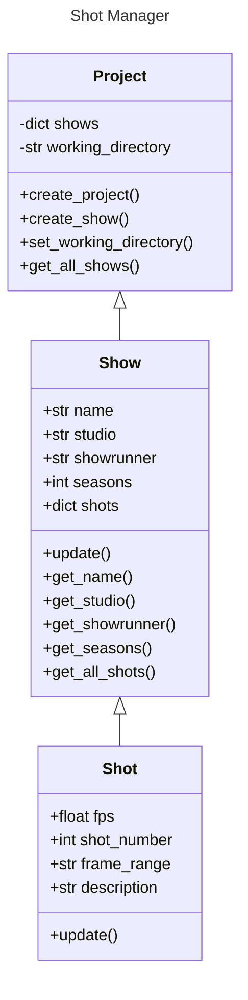

# Data Model

## Class Diagram

## Structure

The Shot Manager is made up of 3 classes:
- Project
- Show
- Shot

### Project
The Project class forms the basis of the manager's hierarchy. It contains functionality for creating the basic folder structure of a project and populating the folder with shows.

Using this structure, multiple projects can easily be managed simply by creating a new instance of the Project class, which prevents shows being put into the wrong projects.

The Project class also includes a dictionary of shows contained within the project, which can be read.

### Show
The Show class functions much in the same way as the Project class, but containing a dictionary of shots instead of shows. Similar to the Project class, this ensures that shots are not misplaced into other shows.

### Shot
This class contains information regarding an individual shot, which can be accessed through the Show class which it is a part of.